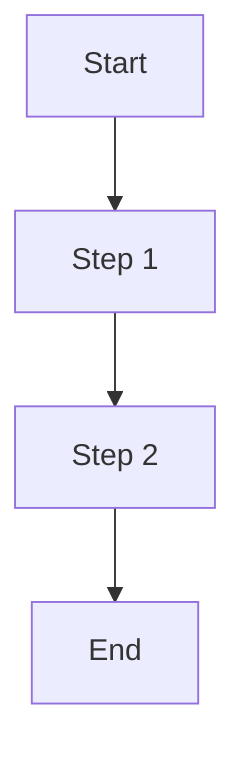

# [Feature Name] - Functional Specification

## Overview
Brief description (3-5 lines)

## Actors
- **User**: [Description]
- **System**: [Description]

## User Stories
- As a [role], I want to [action], so that [benefit]

## Flows

### Main Flow

### Alternative Flows
1. **[Scenario Name]**: Description

## Acceptance Criteria
- [ ] Criterion 1
- [ ] Criterion 2
- [ ] Criterion 3

## Dependencies
- None | List of dependent tasks

## Business Decisions
| Decision | Rationale | Date |
|----------|-----------|------|
|          |           |      |

## Notes
Additional context or clarifications
