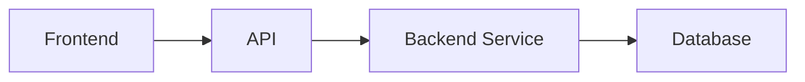

# [Feature Name] - Technical Specification

## Technology Stack
- **Frontend**: [Framework/libraries to use]
- **Backend**: [Framework/libraries to use]
- **Database**: [Type and considerations]
- **Other**: [Additional tools, services, or integrations]

## Architecture Overview

Brief description of how this feature fits into the overall system architecture.

## Technical Considerations

### Frontend Considerations
- **Design System**: Which components from the design system should be used
- **State Management**: How data should be managed (local state, global state, cache)
- **Routing**: Any new routes or navigation changes needed
- **Integration Points**: Which APIs or services to integrate with
- **Architecture Impact**: How this feature affects the current frontend architecture

### Backend Considerations
- **API Design**: High-level approach for API endpoints (RESTful, GraphQL, etc.)
- **Business Logic**: Key business rules and validation requirements
- **Data Access**: Approach for data persistence and retrieval
- **Integration Points**: External services or internal systems to integrate with
- **Architecture Impact**: How this feature affects the current backend architecture

### Security Considerations
- Authentication and authorization requirements
- Data validation and sanitization needs
- Sensitive data handling
- Rate limiting or other protection mechanisms

### Performance Considerations
- Expected load and scaling requirements
- Caching strategy (if applicable)
- Optimization needs (if applicable)
- Database indexing considerations

## Architectural Decisions

### Decision 1: [Decision Title]
**Context**: Why this decision is needed
**Decision**: What was decided
**Rationale**: Why this approach was chosen
**Alternatives Considered**: Other options and why they were not chosen

### ADR References
- **ADR-XXX**: [ADR Title] - [How it applies to this task]

## Testing Strategy
- **Unit Tests**: What should be tested at the unit level
- **Integration Tests**: What integration points need testing
- **E2E Tests**: Critical user flows to test end-to-end (if applicable)

## Complexity Estimate
**[Low | Medium | High]**

**Justification**:
- Reason 1
- Reason 2

## Implementation Notes
- Any specific technical constraints or requirements
- Known technical debt or limitations to work around
- Suggested implementation approach (high-level only)
- Dependencies on other tasks or external factors

## Risks and Mitigation
| Risk | Impact | Mitigation Strategy |
|------|--------|---------------------|
|      |        |                     |
