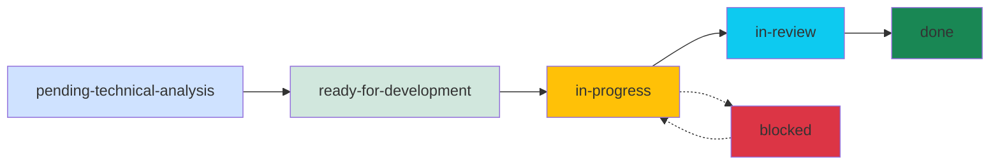

# Rumiator - Iterative Project Development System

**Rumiator** is a comprehensive project development framework for Claude Code that implements the Rational Unified Process (RUP) methodology through specialized agents and workflow commands.

## ⚡ What's New: Simplified Workflow

**Rumiator has been streamlined** to make development faster and more efficient:
- ✅ **2-phase workflow** instead of 3 (Task Creation → Technical Analysis → Development)
- ✅ **Business requirements** integrated directly into task creation
- ✅ **Technical specs** focus on high-level guidance, not implementation details
- ✅ **Developers** make implementation decisions based on business requirements and architectural guidance
- ❌ No more separate business analysis phase
- ❌ No more detailed API specs, data models, or schemas in technical docs

## 🎯 Overview

Rumiator helps you build software projects iteratively by:
- Breaking down product ideas into manageable iterations
- Creating clear business requirements for every feature
- Providing architectural guidance without over-specifying
- Maintaining comprehensive documentation
- Tracking progress systematically
- Involving you in every important decision

## 🏗️ Architecture

### Agents (Specialized Workers)
- **project-manager**: Creates product vision and iteration plans
- **functional-analyst**: Creates task definitions with business requirements (summary, user stories, acceptance criteria)
- **architect**: Provides high-level technical guidance and manages architectural decisions (ADRs)
- **developer-frontend**: Implements frontend features based on business requirements and technical guidance
- **developer-backend**: Implements backend features based on business requirements and technical guidance
- **devops**: Sets up CI/CD and infrastructure
- **quality-assurance**: Reviews and validates implementations

### Commands (Workflow Triggers)
Commands orchestrate the agents to guide you through the development process.

## 📁 Project Structure

After initialization, your project will have:

```
your-project/
├── .rumiator/
│   ├── config.yml              # Project configuration
│   └── templates/              # Document templates
├── docs/
│   ├── product/
│   │   ├── product-idea.md     # Initial product concept
│   │   ├── product-plan.md     # Comprehensive product plan
│   │   └── architecture.md     # System architecture
│   ├── features/               # Feature specifications
│   │   ├── auth/
│   │   │   ├── functional.md   # Business requirements
│   │   │   └── technical.md    # Technical design
│   │   └── dashboard/
│   │       ├── functional.md
│   │       └── technical.md
│   ├── adr/                    # Architecture Decision Records
│   │   ├── ADR-001-framework-choice.md
│   │   └── ADR-002-database-selection.md
│   └── iterations/             # Iterations
└── repositories/               # Source code
```

## 🚀 Getting Started

### 1. Initialize Your Project

```bash
/rumiator-init
```

This command:
- Creates the directory structure
- Sets up configuration files
- Prepares templates
- Creates a basic README

You'll be asked for:
- Project name
- Brief description
- Preferred tech stack (optional)

### 2. Create Product Vision

```bash
/rumiator-create-product
```

This command:
- Asks you to describe your product idea
- Creates `docs/product/product-idea.md`
- Launches the PM agent to analyze it
- Generates `docs/product/product-plan.md` with:
  - Vision and objectives
  - Stakeholder identification
  - Iteration breakdown
  - Risk analysis
  - Legal/compliance considerations

**Example interaction:**
```
> What problem does your product solve?

"I want to build a task management app for remote teams
that makes it easy to track progress and collaborate."

> Who are the target users?

"Remote teams of 5-50 people, primarily in tech companies."

> What are the main features?

"Task creation, assignment, progress tracking,
real-time collaboration, notifications."
```

The PM will generate a plan with iterations like:
- **Iteration 1**: MVP (Auth, Basic CRUD, Simple Dashboard)
- **Iteration 2**: Collaboration (Real-time updates, Comments)
- **Iteration 3**: Advanced (Analytics, Integrations)

## 📋 Workflow: From Idea to Implementation

### Phase 1: Task Creation with Business Requirements

#### Create Tasks
```bash
/rumiator-create-tasks
```

The functional analyst:
- Reads the product plan
- Identifies features for current iteration
- Creates task files (docs/iterations/iteration-XX/tasks/TASK-XXX.yml) with:
  - **Summary**: 3-5 line description of what the task accomplishes
  - **User Stories**: User-focused stories describing the feature
  - **Acceptance Criteria**: Specific, testable criteria
- Sets status to "pending-technical-analysis" (ready for architect)
- **Asks you** if requirements are unclear

**Example task YAML:**
```yaml
id: TASK-001
title: "User Registration and Email Verification"
feature: authentication
status: pending-technical-analysis
priority: high

summary: "Enable users to register for an account using their email address. Users must verify their email before accessing the platform. This provides secure account creation and ensures valid contact information."

user_stories:
  - "As a new user, I want to register with my email and password, so that I can create an account"
  - "As a new user, I want to receive a verification email, so that I can confirm my email address"
  - "As a registered user, I want to verify my email through a link, so that I can access the platform"

acceptance_criteria:
  - "User can register by providing email, password, and name"
  - "Email must be unique across all users"
  - "Password must be at least 8 characters with at least one number"
  - "User receives verification email within 1 minute of registration"
  - "User cannot log in until email is verified"
  - "Verification link expires after 24 hours"
```

### Phase 2: Technical Analysis

#### Create Technical Guidance
```bash
/rumiator-analyze-tech all
# or for a specific task:
/rumiator-analyze-tech TASK-001
```

For each task, the architect:
- Reads business requirements from task YAML
- Creates `docs/features/[feature]/technical.md` with **high-level guidance**:
  - Technology stack to use
  - Design system components to leverage
  - Architecture approach and impact
  - Security and performance considerations
  - Testing strategy
- Creates ADRs for significant decisions and **validates with you**
- Updates `docs/product/architecture.md` if needed
- Updates task status to "ready-for-development"
- **Does NOT write**: API specs, data models, schemas, or code

**Example technical spec:**
```markdown
# User Authentication - Technical Specification

## Technology Stack
- **Frontend**: React 18 with TypeScript, TanStack Query
- **Backend**: Node.js with Express, JWT for authentication
- **Database**: PostgreSQL for user data

## Technical Considerations

### Frontend Considerations
- **Design System**: Use existing Form, Input, and Button components
- **State Management**: Use React Context for auth state
- **Routing**: Add /register, /login, /verify-email routes
- **Architecture Impact**: Establishes authentication pattern for all future features

### Backend Considerations
- **API Design**: RESTful endpoints for register, login, verify, refresh
- **Business Logic**: Email uniqueness validation, password hashing, token generation
- **Data Access**: Repository pattern for user data access
- **Architecture Impact**: Establishes JWT-based auth pattern

### Security Considerations
- Passwords must be hashed with bcrypt (12 rounds)
- JWT tokens should be short-lived (15 min) with refresh tokens
- Rate limit authentication endpoints to prevent brute force

## Complexity: Medium
- Standard authentication flow
- Multiple integration points (email service, JWT)
- Security requirements add complexity
```

### Phase 3: Development

#### Develop a Specific Task
```bash
/rumiator-develop TASK-001
```

The system:
- Determines task type (frontend/backend/devops/fullstack)
- Launches appropriate developer agent(s)
- For fullstack: backend first, then frontend
- Developers:
  - Implement the feature
  - Write tests
  - Run tests and linters
  - **Ask you** if implementation details are unclear
  - Update task status to "done"

#### Develop Next Task Automatically
```bash
/rumiator-develop-next
```

The system:
- Finds highest-priority task that's ready
- Shows you the task
- Asks for confirmation
- Develops the task
- Optionally continues to next task

## 📊 Monitoring Progress

### Check Status
```bash
/rumiator-status
```

Displays:
```
═══════════════════════════════════════════════════
  RUMIATOR PROJECT STATUS
═══════════════════════════════════════════════════

Project: Task Manager Pro
Current Iteration: 1 of 3
Progress: ██████░░░░ 60% (9/15 tasks completed)

TASKS BY STATUS
───────────────────────────────────────────────────
✓ Done                           9
⚙ In Progress                    2
→ Ready for Development          2
📋 Pending Technical Analysis    1
📝 Pending Business Analysis     1
✋ Blocked                        0
───────────────────────────────────────────────────

NEXT ACTIONS
───────────────────────────────────────────────────
1. Develop TASK-007 (ready-for-development)
2. Analyze TASK-012 (pending-technical-analysis)

Suggested command: /rumiator-develop-next
═══════════════════════════════════════════════════
```

### Generate Report
```bash
/rumiator-report
```

Creates `docs/iterations/iteration-X-report.md` with:
- Completion statistics
- Velocity metrics
- Decisions made
- Blockers encountered
- Lessons learned
- Next iteration recommendations

## 🔧 Additional Commands

### Update Product Plan
```bash
/rumiator-update-plan
```

When your product vision evolves:
- Updates product-plan.md
- Documents changes in changelog
- Warns about impact on existing tasks

### Block a Task
```bash
/rumiator-block-task TASK-005
```

When you hit a blocker:
- Asks for blocker details
- Updates task status to "blocked"
- Documents in task YAML
- Warns about dependent tasks

### Create Architecture Decision Record
```bash
/rumiator-adr "Choose React over Vue"
```

For important technical decisions:
- Creates numbered ADR (ADR-001, ADR-002, etc.)
- Documents context, decision, consequences
- Includes alternatives considered
- Updates architecture.md

## 💡 Best Practices

### 1. Keep Iterations Small
- 2-4 weeks per iteration
- 5-15 tasks per iteration
- Focus on delivering value early

### 2. Let Agents Ask Questions
- Agents will ask when uncertain
- Your input ensures quality
- Don't skip clarifications

### 3. Review Generated Docs
- Agents create drafts
- You refine and approve
- Keep docs up to date

### 4. Commit Regularly
- After each completed task
- After each iteration
- Keep git history clean

### 5. Use Status Dashboard
- Run `/rumiator-status` frequently
- Stay aware of blockers
- Track progress visually

## 🔄 Complete Workflow Example

```bash
# Day 1: Setup
/rumiator-init
/rumiator-create-product

# Day 2: Planning
/rumiator-create-tasks           # Creates tasks with business requirements
/rumiator-analyze-tech all       # Architect provides technical guidance

# Days 3-10: Development
/rumiator-develop-next           # Repeat for each task
/rumiator-status                 # Check progress

# Day 11: Review
/rumiator-report
# Review iteration-01-report.md
# Plan iteration 2

# Commit and deploy
git add .
git commit -m "Complete iteration 1"
git push
```

**What changed**: Business analysis is now integrated into task creation, making the workflow faster and simpler.

## 📚 Task Lifecycle



**Simplified workflow**: Tasks now start at `pending-technical-analysis` with business requirements already included.

## 🎓 Understanding Task Files

### Task YAML Example
```yaml
id: TASK-001
title: "User Authentication"
feature: auth
status: ready-for-development
priority: high
iteration: 1
created: "2025-10-10"
updated: "2025-10-11"

# Functional Information (created during task creation)
summary: "Enable users to register and log in to access the platform. Includes email verification to ensure valid contact information and secure account creation."

user_stories:
  - "As a new user, I want to register with email/password, so that I can create an account"
  - "As a user, I want to verify my email, so that I can prove ownership"
  - "As a returning user, I want to log in securely, so that I can access my account"

acceptance_criteria:
  - "User can register with email, password, and name"
  - "User can log in with valid credentials"
  - "Password must be at least 8 characters with at least one number"
  - "Email must be unique across all users"
  - "User receives verification email within 1 minute"
  - "User cannot log in until email is verified"

# Analysis
business_analyst: "functional-analyst"
architect: "architect"

# Execution
developers: []
estimated_complexity: medium

# Status
blockers: []
notes: ""

# References
functional_spec: ""
technical_spec: "docs/features/auth/technical.md"
related_adrs: ["ADR-001"]
```

**Key changes**: Business requirements (summary, user stories, acceptance criteria) are now in the task YAML, not in a separate functional spec.

## 🐛 Bug Management

Rumiator now includes comprehensive bug tracking that integrates seamlessly with your feature development workflow.

### Creating Bug Reports

When you discover a bug during development or testing:

```bash
/rumiator-create-bug TASK-001
```

Or create a standalone bug:
```bash
/rumiator-create-bug
```

The system will:
1. Ask for bug details (severity, steps to reproduce, expected vs actual behavior)
2. Create a bug task (type: bug) with unique TASK-ID
3. Determine iteration placement based on severity:
   - **Critical/High**: Added to current iteration immediately
   - **Medium**: Added to current iteration
   - **Low**: Added to backlog (next iteration)
4. Link bug to related feature tasks if applicable
5. Create bug analysis document in `docs/features/[feature]/bugs/`
6. Launch functional-analyst to analyze root cause

**Bug Task Example:**
```yaml
id: TASK-015
type: bug
title: "Login fails on Safari browser"
feature: auth
status: pending-technical-analysis
priority: critical
iteration: 1

bug_info:
  related_tasks: ["TASK-001"]
  severity: critical
  steps_to_reproduce: |
    1. Open Safari browser
    2. Navigate to /login
    3. Enter valid credentials
    4. Click login button
  expected_behavior: "User should be logged in and redirected to dashboard"
  actual_behavior: "Page refreshes but user remains on login page"
  root_cause: "Cookie SameSite attribute not compatible with Safari"

related_bugs: []
related_adrs: []
```

### Triaging Bugs

Periodically review all bugs to prioritize and plan fixes:

```bash
/rumiator-triage-bugs
```

The system will:
1. Scan all bug tasks across iterations
2. Group bugs by:
   - Severity (critical/high/medium/low)
   - Status (new/analyzed/ready/in-progress)
   - Feature (identify patterns)
   - Related tasks (impact analysis)
3. Launch analyst + architect agents to:
   - Identify architectural issues
   - Spot patterns indicating deeper problems
   - Recommend quick wins
   - Suggest which bugs need architecture review
4. Ask you to prioritize bugs for current iteration
5. Update bug tasks with new priorities/iterations
6. Create bug triage report in `docs/iterations/iteration-[XX]/bug-triage-report.md`
   - Where XX is the current iteration number padded to 2 digits (01, 02, etc.)

**Triage Output Example:**
```
Bug Triage Summary
==================

Total Bugs: 12
- Critical: 2 (both in current iteration)
- High: 3
- Medium: 5
- Low: 2

Critical Bugs Requiring Attention:
  🔴 TASK-015: Login fails on Safari (ready-to-fix)
  🔴 TASK-022: Data loss on logout (needs-analysis)

Architecture Issues Detected:
  ⚠️ 3 bugs in 'auth' feature suggest session management issue
  → Recommendation: Run /rumiator-review-architecture ADR-001

Quick Wins (2 bugs, ~3 hours total):
  TASK-018: Button alignment on mobile
  TASK-019: Typo in error message
```

### Fixing Bugs

Bugs are developed like regular tasks:

```bash
/rumiator-develop TASK-015
```

The system:
1. Reads bug_info from task YAML
2. Displays bug details and analysis
3. Launches appropriate developer agent
4. Developer agent:
   - Fixes root cause (not just symptoms)
   - Adds regression tests
   - Verifies fix against acceptance criteria
   - Updates bug analysis with resolution notes
5. If bug reveals larger architectural issue:
   - Suggests creating architecture-review task
   - Links to relevant ADR

**Bug Development Workflow:**
```
Bug Created → Analysis → Technical Spec → Fix → Test → Verify → Done
     ↓                                                            ↓
If architecture issue detected → Create architecture-review task
```

## 🏗️ Architecture Management

Architecture decisions evolve as you learn more during development. Rumiator helps you review and update architectural decisions systematically.

### When to Review Architecture

Trigger an architecture review when:
- Development reveals current approach is unworkable
- Multiple bugs indicate architectural flaw
- New requirements make current decision obsolete
- Performance/scalability issues emerge
- Technical debt becomes unsustainable

### Reviewing Architectural Decisions

```bash
/rumiator-review-architecture ADR-001
```

Or scan for problems automatically:
```bash
/rumiator-review-architecture
```

The review process:

**Phase 1: Identify the Problem**
- System scans for blocked tasks and high-severity bugs
- You specify which ADR to review
- System asks: What's wrong with current approach?

**Phase 2: Impact Analysis**
- Finds all tasks referencing the ADR
- Identifies affected technical specs
- Groups tasks by status (done/in-progress/pending)
- Estimates rework effort

**Phase 3: Generate Alternatives**
- Architect agent proposes 2-4 alternative approaches
- For each alternative:
  * How it solves the problem
  * Migration path from current approach
  * Impact on existing work
  * Effort estimate
  * Pros/cons vs original decision
  * Risk assessment

**Phase 4: Decision & Propagation**
- You select preferred approach
- System creates new ADR (ADR-XXX) superseding old one
- Updates old ADR status to "Superseded by ADR-XXX"
- Updates `docs/product/architecture.md`
- Calls `/rumiator-propagate-architecture-change` automatically

**Example ADR Supersession:**

*Old ADR (ADR-001):*
```markdown
# ADR-001: Use MongoDB for data storage

⚠️ SUPERSEDED by ADR-005 on 2025-10-15
See ADR-005 for current decision.

**Status**: Superseded
**Date**: 2025-10-01

## Decision
Use MongoDB as primary database...

## Consequences
- NoSQL flexibility
- Horizontal scaling
...
```

*New ADR (ADR-005):*
```markdown
# ADR-005: Migrate to PostgreSQL with JSONB

**Status**: Accepted
**Date**: 2025-10-15
**Supersedes**: ADR-001
**Deciders**: Tech Lead, Architect

## Context
During development of TASK-015 and TASK-020, we discovered:
- Need for complex relational queries (ADR-001 assumed simple docs)
- ACID transactions critical for payment processing
- MongoDB's transaction model causing race conditions
- Team has stronger PostgreSQL expertise

## Decision
Migrate from MongoDB (ADR-001) to PostgreSQL with JSONB columns.
Preserve flexibility where needed via JSONB, gain relational power.

## Consequences

### Positive
- ACID transactions solve race conditions
- Complex joins now possible
- Better tooling and team expertise
- JSONB provides schema flexibility where needed

### Negative
- Migration effort: ~2 weeks
- 5 completed tasks need schema updates
- Learning curve for JSONB features

## Alternatives Considered
1. **Stick with MongoDB**: Rejected - race conditions unacceptable
2. **Use MySQL**: Rejected - no JSONB equivalent, less flexible
3. **Use both (polyglot)**: Rejected - operational complexity too high

## Migration Plan
See architecture-change-ADR-005.md for detailed migration steps
```

### Propagating Architecture Changes

After an ADR is updated:

```bash
/rumiator-propagate-architecture-change ADR-005
```

The system:

**Phase 1: Discover Affected Components**
- Scans technical specs for ADR references
- Finds tasks with related_adrs containing old ADR
- Uses architect to identify implicit dependencies
- Creates comprehensive impact report

**Phase 2: Categorize Impact**
- **Completed tasks** (status: done):
  * Creates architecture-review tasks
  * You decide: review now vs later
- **In-progress tasks**:
  * Asks: Pause and redesign? Or continue and refactor later?
  * Updates task status accordingly
- **Ready-for-development tasks**:
  * Asks: Update specs now or on-demand?
  * Architect updates technical specs with new approach
- **Pending-analysis tasks**:
  * Adds notes to use new ADR during analysis
  * No immediate action needed

**Phase 3: Execute Updates**
- Creates architecture-review tasks for completed work
- Blocks in-progress tasks if needed
- Updates technical specs for ready tasks
- Adds ADR references to pending tasks
- Updates all task YAMLs with related_adrs

**Phase 4: Documentation**
- Read current iteration number from .rumiator/config.yml
- Create iteration directory if needed: docs/iterations/iteration-[XX]/
- Creates `docs/iterations/iteration-[XX]/architecture-change-ADR-XXX.md`
  - Where XX is the current iteration number padded to 2 digits (01, 02, etc.)
- Documents all changes made
- Lists affected tasks with recommended actions
- Provides team communication template
- Updates iteration plan

**Architecture Review Task Example:**
```yaml
id: TASK-040
type: architecture-review
title: "Review User Auth implementation against ADR-005"
status: pending-technical-analysis
priority: high
iteration: 2

architecture_review:
  related_adr: "ADR-005"
  affected_tasks: ["TASK-001", "TASK-012"]
  reason: "ADR-005 supersedes ADR-001 - need to migrate from MongoDB to PostgreSQL"

notes: |
  Original tasks used MongoDB. Need to:
  1. Assess current implementation
  2. Plan migration to PostgreSQL
  3. Decide: refactor now or create new task
```

### Verifying ADRs During Technical Analysis

The `/rumiator-analyze-tech` command now automatically verifies ADRs:

```bash
/rumiator-analyze-tech TASK-025
```

After creating the technical spec:
1. System scans spec for ADR references
2. Reads each referenced ADR
3. Checks ADR status field
4. If status is "Superseded":
   ```
   ⚠️ WARNING: Architecture Decision Outdated

   Technical spec references ADR-001 which has been SUPERSEDED
   Old ADR: ADR-001 - MongoDB for data storage
   Status: Superseded by ADR-005
   New ADR: ADR-005 - PostgreSQL with JSONB

   Options:
   1. Update spec now to use ADR-005 (recommended)
   2. Review architecture: /rumiator-review-architecture ADR-001
   3. Proceed anyway (not recommended - may cause rework)
   ```
5. Based on your choice:
   - Updates spec with new ADR
   - Pauses analysis for architecture review
   - Or proceeds with warning

This prevents implementing tasks with outdated architecture decisions.

## 🛠️ Customization

### Modify Agent Behavior
Edit `.claude/agents/[agent-name].md` to customize:
- Decision-making thresholds
- Documentation style
- Code patterns
- Quality standards

### Modify Workflows
Edit `.claude/commands/[command-name].md` to:
- Adjust workflow steps
- Add validation rules
- Customize output format

### Modify Templates
Edit `.rumiator/templates/*.md` to:
- Change document structure
- Add custom sections
- Adjust formatting

## 🚀 Release Management & Updates

Rumiator includes an automated release system to ensure stable and consistent updates across all installations.

### How Releases Work

1. **Automatic Release Creation**
   - When `RUMIATOR_CHANGELOG.md` is updated with a new version (format: `[X.Y.Z] - YYYY-MM-DD`)
   - GitHub Actions workflow automatically detects the version change
   - The workflow verifies `config.yml.template` has matching `rumiator_version`
   - If versions don't match, it automatically updates and commits the config
   - Creates a GitHub Release with:
     - Tag: `vX.Y.Z`
     - Title: `Version X.Y.Z`
     - Body: Summary of changes + comparison link (e.g., `2.3.0...2.4.0`)

2. **Stable Updates with `/rumiator-update`**
   - Fetches the latest **published GitHub Release** (not master branch)
   - Ensures you receive tested, stable versions
   - Falls back to master branch only if:
     - GitHub API is unavailable
     - No releases have been published yet
     - Displays warning when using fallback mode

### Benefits

- ✅ **Consistency** - Version in changelog always matches config
- ✅ **Stability** - Updates use verified releases, not work-in-progress code
- ✅ **Traceability** - Each release has clear changelog and comparison
- ✅ **Automation** - No manual release creation needed
- ✅ **Transparency** - Full change history with links to diffs

### For Contributors

When adding new features to Rumiator:

1. Make your changes in a feature branch
2. Update `RUMIATOR_CHANGELOG.md` with new version entry:
   ```markdown
   ## [X.Y.Z] - YYYY-MM-DD

   ### Summary
   Brief description of changes

   ### Added/Changed/Fixed
   - Detailed changes...

   ### Migration Instructions
   - Type: automatic/manual/none
   - Actions: ...
   ```
3. Commit and push to master
4. GitHub Actions automatically:
   - Updates `config.yml.template` if needed
   - Creates the release with summary and comparison link

### Version Numbering

Rumiator follows [Semantic Versioning](https://semver.org/):
- **MAJOR** (X.0.0) - Breaking changes, manual migration required
- **MINOR** (0.X.0) - New features, backwards compatible
- **PATCH** (0.0.X) - Bug fixes, backwards compatible

## ❓ FAQ

### When should I use Rumiator?
- Building new products from scratch
- Projects requiring clear documentation
- Teams following RUP/iterative methodology
- When you want AI assistance with planning AND implementation

### Can I use it with existing projects?
Yes! Run `/rumiator-init` in your project. You can:
- Document existing features retroactively
- Use it for new features only
- Gradually adopt the workflow

### How much control do I have?
Complete control. Agents:
- Ask before making important decisions
- Generate drafts you can edit
- Follow your preferences
- Stop if uncertain

### Do I need to use all commands?
No. Use what fits your workflow:
- Minimum: init → create-product → create-tasks → develop
- Full: All commands for complete process tracking

### What if an agent makes a mistake?
- You can edit any generated document
- Regenerate with `/rumiator-update-plan`
- Provide feedback to improve output

## 🤝 Contributing

To improve Rumiator:
1. Modify agent prompts in `.claude/agents/`
2. Enhance commands in `.claude/commands/`
3. Update templates in `.rumiator/templates/`
4. Share improvements with the community

## 📄 License

This framework is provided as-is for use with Claude Code.

---

**Ready to start?** Run `/rumiator-init` and begin building your product iteratively! 🚀
