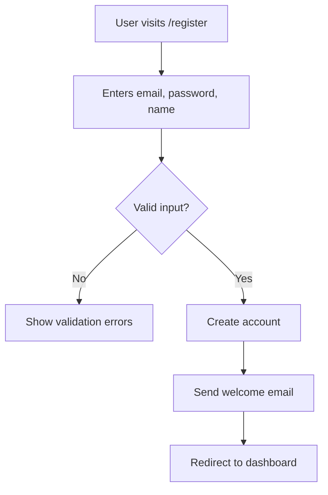
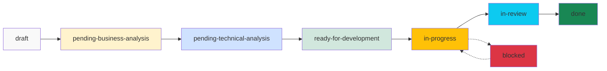

# Rumiator - Iterative Project Development System

**Rumiator** is a comprehensive project development framework for Claude Code that implements the Rational Unified Process (RUP) methodology through specialized agents and workflow commands.

## 🎯 Overview

Rumiator helps you build software projects iteratively by:
- Breaking down product ideas into manageable iterations
- Creating detailed specifications for every feature
- Maintaining comprehensive documentation
- Tracking progress systematically
- Involving you in every important decision

## 🏗️ Architecture

### Agents (Specialized Workers)
- **project-manager**: Creates product vision and iteration plans
- **functional-analyst**: Writes business requirements and acceptance criteria
- **architect**: Designs technical architecture and specifications
- **developer-frontend**: Implements frontend features
- **developer-backend**: Implements backend features
- **devops**: Sets up CI/CD and infrastructure
- **quality-assurance**: Reviews and validates implementations

### Commands (Workflow Triggers)
Commands orchestrate the agents to guide you through the development process.

## 📁 Project Structure

After initialization, your project will have:

```
your-project/
├── .rumiator/
│   ├── config.yml              # Project configuration
│   ├── tasks/                  # Task definitions (YAML)
│   │   ├── TASK-001.yml
│   │   └── TASK-002.yml
│   └── templates/              # Document templates
├── docs/
│   ├── product/
│   │   ├── product-idea.md     # Initial product concept
│   │   ├── product-plan.md     # Comprehensive product plan
│   │   └── architecture.md     # System architecture
│   ├── features/               # Feature specifications
│   │   ├── auth/
│   │   │   ├── functional.md   # Business requirements
│   │   │   └── technical.md    # Technical design
│   │   └── dashboard/
│   │       ├── functional.md
│   │       └── technical.md
│   ├── adr/                    # Architecture Decision Records
│   │   ├── ADR-001-framework-choice.md
│   │   └── ADR-002-database-selection.md
│   └── iterations/             # Iteration reports
│       └── iteration-01-report.md
└── src/                        # Source code
```

## 🚀 Getting Started

### 1. Initialize Your Project

```bash
/rumiator-init
```

This command:
- Creates the directory structure
- Sets up configuration files
- Prepares templates
- Creates a basic README

You'll be asked for:
- Project name
- Brief description
- Preferred tech stack (optional)

### 2. Create Product Vision

```bash
/rumiator-create-product
```

This command:
- Asks you to describe your product idea
- Creates `docs/product/product-idea.md`
- Launches the PM agent to analyze it
- Generates `docs/product/product-plan.md` with:
  - Vision and objectives
  - Stakeholder identification
  - Iteration breakdown
  - Risk analysis
  - Legal/compliance considerations

**Example interaction:**
```
> What problem does your product solve?

"I want to build a task management app for remote teams
that makes it easy to track progress and collaborate."

> Who are the target users?

"Remote teams of 5-50 people, primarily in tech companies."

> What are the main features?

"Task creation, assignment, progress tracking,
real-time collaboration, notifications."
```

The PM will generate a plan with iterations like:
- **Iteration 1**: MVP (Auth, Basic CRUD, Simple Dashboard)
- **Iteration 2**: Collaboration (Real-time updates, Comments)
- **Iteration 3**: Advanced (Analytics, Integrations)

## 📋 Workflow: From Idea to Implementation

### Phase 1: Planning

#### Create Tasks
```bash
/rumiator-create-tasks
```

The functional analyst:
- Reads the product plan
- Identifies features for current iteration
- Creates task files (.rumiator/tasks/TASK-XXX.yml)
- Sets status to "pending-business-analysis"

### Phase 2: Business Analysis

#### Analyze Requirements
```bash
/rumiator-analyze-business all
# or for a specific task:
/rumiator-analyze-business TASK-001
```

For each task, the functional analyst:
- Creates `docs/features/[feature]/functional.md`
- Documents:
  - User stories
  - Detailed flows (with Mermaid diagrams)
  - Acceptance criteria
  - Business rules
- **Asks you** if requirements are unclear
- Updates task status to "pending-technical-analysis"

**Example functional spec:**
```markdown
# User Authentication - Functional Specification

## Overview
Users must be able to register and log in to access the platform.

## User Stories
- As a new user, I want to register with email/password
- As a returning user, I want to log in securely

## Flows


## Acceptance Criteria
- [ ] User can register with valid email/password
- [ ] Password must be at least 8 characters
- [ ] Email must be unique
- [ ] User receives welcome email
- [ ] User is logged in after registration
```

### Phase 3: Technical Analysis

#### Create Technical Specs
```bash
/rumiator-analyze-tech all
# or for a specific task:
/rumiator-analyze-tech TASK-001
```

For each task, the architect:
- Creates `docs/features/[feature]/technical.md`
- Specifies:
  - API endpoints
  - Data models
  - Database schema
  - Security considerations
  - Testing strategy
- Updates `docs/product/architecture.md`
- Creates ADRs for significant decisions
- **Asks you** about tech preferences if needed
- Updates task status to "ready-for-development"

**Example technical spec:**
```markdown
# User Authentication - Technical Specification

## API Endpoints

### POST /api/auth/register
**Request:**
```json
{
  "email": "user@example.com",
  "password": "securePass123",
  "name": "John Doe"
}
```

**Response (201):**
```json
{
  "id": "uuid",
  "email": "user@example.com",
  "name": "John Doe",
  "token": "jwt-token"
}
```

## Data Model
```typescript
interface User {
  id: string;
  email: string;
  passwordHash: string;
  name: string;
  createdAt: Date;
}
```

## Complexity: Medium
- Standard auth flow
- JWT implementation
- Password hashing with bcrypt
```

### Phase 4: Development

#### Develop a Specific Task
```bash
/rumiator-develop TASK-001
```

The system:
- Determines task type (frontend/backend/devops/fullstack)
- Launches appropriate developer agent(s)
- For fullstack: backend first, then frontend
- Developers:
  - Implement the feature
  - Write tests
  - Run tests and linters
  - **Ask you** if implementation details are unclear
  - Update task status to "done"

#### Develop Next Task Automatically
```bash
/rumiator-develop-next
```

The system:
- Finds highest-priority task that's ready
- Shows you the task
- Asks for confirmation
- Develops the task
- Optionally continues to next task

## 📊 Monitoring Progress

### Check Status
```bash
/rumiator-status
```

Displays:
```
═══════════════════════════════════════════════════
  RUMIATOR PROJECT STATUS
═══════════════════════════════════════════════════

Project: Task Manager Pro
Current Iteration: 1 of 3
Progress: ██████░░░░ 60% (9/15 tasks completed)

TASKS BY STATUS
───────────────────────────────────────────────────
✓ Done                           9
⚙ In Progress                    2
→ Ready for Development          2
📋 Pending Technical Analysis    1
📝 Pending Business Analysis     1
✋ Blocked                        0
───────────────────────────────────────────────────

NEXT ACTIONS
───────────────────────────────────────────────────
1. Develop TASK-007 (ready-for-development)
2. Analyze TASK-012 (pending-technical-analysis)

Suggested command: /rumiator-develop-next
═══════════════════════════════════════════════════
```

### Generate Report
```bash
/rumiator-report
```

Creates `docs/iterations/iteration-X-report.md` with:
- Completion statistics
- Velocity metrics
- Decisions made
- Blockers encountered
- Lessons learned
- Next iteration recommendations

## 🔧 Additional Commands

### Update Product Plan
```bash
/rumiator-update-plan
```

When your product vision evolves:
- Updates product-plan.md
- Documents changes in changelog
- Warns about impact on existing tasks

### Block a Task
```bash
/rumiator-block-task TASK-005
```

When you hit a blocker:
- Asks for blocker details
- Updates task status to "blocked"
- Documents in task YAML
- Warns about dependent tasks

### Create Architecture Decision Record
```bash
/rumiator-adr "Choose React over Vue"
```

For important technical decisions:
- Creates numbered ADR (ADR-001, ADR-002, etc.)
- Documents context, decision, consequences
- Includes alternatives considered
- Updates architecture.md

## 💡 Best Practices

### 1. Keep Iterations Small
- 2-4 weeks per iteration
- 5-15 tasks per iteration
- Focus on delivering value early

### 2. Let Agents Ask Questions
- Agents will ask when uncertain
- Your input ensures quality
- Don't skip clarifications

### 3. Review Generated Docs
- Agents create drafts
- You refine and approve
- Keep docs up to date

### 4. Commit Regularly
- After each completed task
- After each iteration
- Keep git history clean

### 5. Use Status Dashboard
- Run `/rumiator-status` frequently
- Stay aware of blockers
- Track progress visually

## 🔄 Complete Workflow Example

```bash
# Day 1: Setup
/rumiator-init
/rumiator-create-product

# Day 2: Planning
/rumiator-create-tasks
/rumiator-analyze-business all
/rumiator-analyze-tech all

# Days 3-10: Development
/rumiator-develop-next  # Repeat for each task
/rumiator-status        # Check progress

# Day 11: Review
/rumiator-report
# Review iteration-01-report.md
# Plan iteration 2

# Commit and deploy
git add .
git commit -m "Complete iteration 1"
git push
```

## 📚 Task Lifecycle



## 🎓 Understanding Task Files

### Task YAML Example
```yaml
id: TASK-001
title: "User Authentication"
feature: auth
status: ready-for-development
priority: high
iteration: 1
created: "2025-10-10"
updated: "2025-10-11"

business_analyst: "functional-analyst"
architect: "architect"
developers: []
estimated_complexity: medium

blockers: []
acceptance_criteria:
  - "User can register with email/password"
  - "User can log in with valid credentials"
  - "Password must be at least 8 characters"

functional_spec: "docs/features/auth/functional.md"
technical_spec: "docs/features/auth/technical.md"
```

## 🛠️ Customization

### Modify Agent Behavior
Edit `.claude/agents/[agent-name].md` to customize:
- Decision-making thresholds
- Documentation style
- Code patterns
- Quality standards

### Modify Workflows
Edit `.claude/commands/[command-name].md` to:
- Adjust workflow steps
- Add validation rules
- Customize output format

### Modify Templates
Edit `.rumiator/templates/*.md` to:
- Change document structure
- Add custom sections
- Adjust formatting

## ❓ FAQ

### When should I use Rumiator?
- Building new products from scratch
- Projects requiring clear documentation
- Teams following RUP/iterative methodology
- When you want AI assistance with planning AND implementation

### Can I use it with existing projects?
Yes! Run `/rumiator-init` in your project. You can:
- Document existing features retroactively
- Use it for new features only
- Gradually adopt the workflow

### How much control do I have?
Complete control. Agents:
- Ask before making important decisions
- Generate drafts you can edit
- Follow your preferences
- Stop if uncertain

### Do I need to use all commands?
No. Use what fits your workflow:
- Minimum: init → create-product → create-tasks → develop
- Full: All commands for complete process tracking

### What if an agent makes a mistake?
- You can edit any generated document
- Regenerate with `/rumiator-update-plan`
- Provide feedback to improve output

## 🤝 Contributing

To improve Rumiator:
1. Modify agent prompts in `.claude/agents/`
2. Enhance commands in `.claude/commands/`
3. Update templates in `.rumiator/templates/`
4. Share improvements with the community

## 📄 License

This framework is provided as-is for use with Claude Code.

---

**Ready to start?** Run `/rumiator-init` and begin building your product iteratively! 🚀
